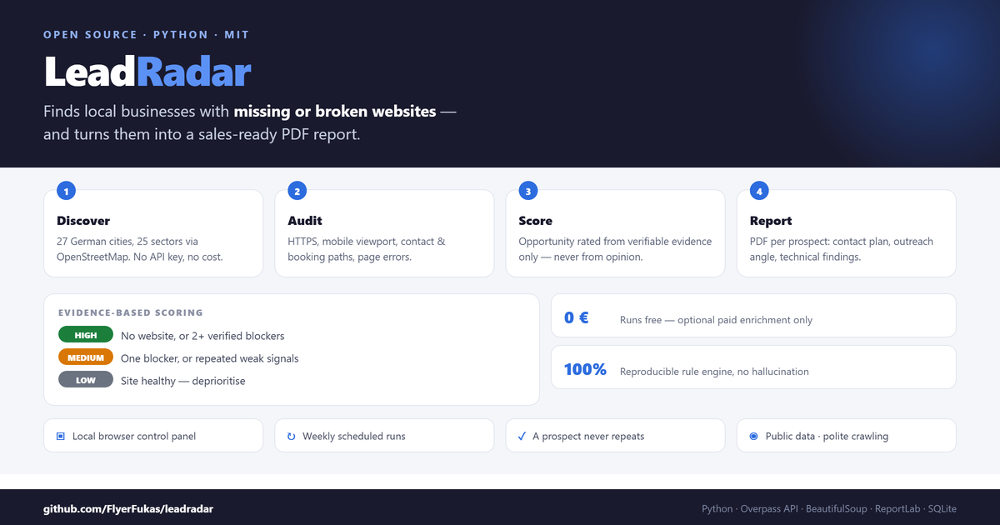
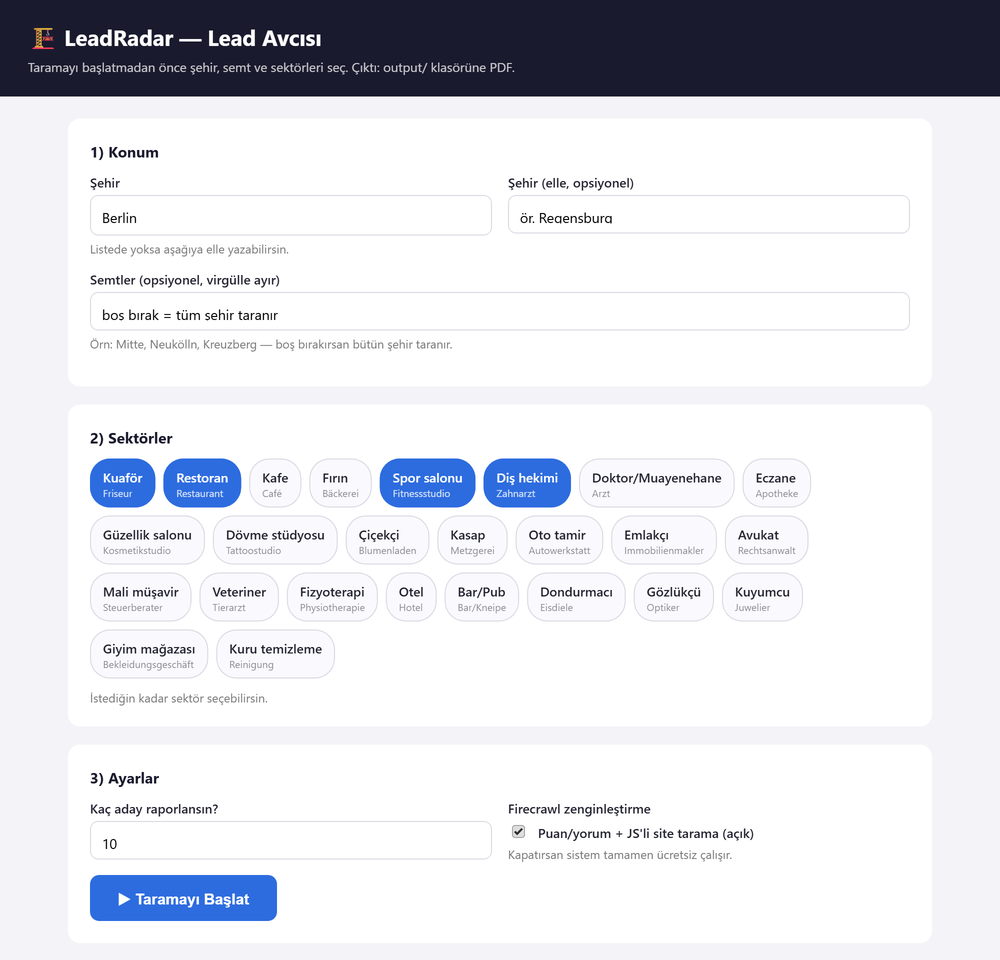

# LeadRadar



[](LICENSE)
[](https://www.python.org/)
[](https://www.openstreetmap.org/copyright)
[](#quick-start)

**Local business lead discovery & enrichment.** Pick a city and a set of sectors
LeadRadar finds businesses with **missing or broken websites**, scores the opportunity
from verifiable evidence, and produces a **sales-ready PDF report**.

Built for web designers, digital agencies, and local B2B sales teams.

> 🇹🇷 Türkçe sürüm: [README.tr.md](README.tr.md)

---

## The control panel

Pick a city, optional districts and any number of sectors then start the scan
and watch progress stream live in the browser.



---

## What it does

- 🗺️ **Discovery** Scans businesses across **27 German cities** and **25 sectors**
  via OpenStreetMap (Overpass API). No API key required, completely free.
- 🔍 **Website audit** Tests each prospect's site: HTTPS, mobile-friendliness
  (viewport), working contact paths, broken booking links, page errors.
- 🎯 **Evidence-based scoring** HIGH / MEDIUM / LOW opportunity score. Scores are
  derived **only from verified findings**; subjective impressions ("looks outdated")
  are tracked separately and can never on their own produce a HIGH score.
- 🧠 **Deduplication** Previously reported businesses never appear again
  (SQLite fingerprint memory).
- 📄 **PDF report** One page per prospect: parameters → contact details and an
  outreach plan → website issues with a technical audit table.
- 🖥️ **Local control panel** Pick city, districts, and sectors in your browser,
  then start the scan and watch live progress.

---

## Quick start

```bash
git clone https://github.com/FlyerFukas/leadradar.git
cd leadradar
py -m pip install -r requirements.txt
py panel.py
```

Your browser opens at **http://127.0.0.1:8765** select a city, optional districts and
sectors, then hit "Start scan". Progress streams live and a link to the PDF appears when
the run finishes.

Without the panel, from the command line:

```bash
py run.py                # default weekly rotation
py run.py --limit 5      # quick trial with fewer prospects
```

**Requirements:** Python 3.10+ and an internet connection.

---

## 🔑 Firecrawl (optional) bring your own account

LeadRadar **works fully without Firecrawl.** When enabled, it adds two capabilities:

1. Pulls **ratings and review counts** from directories (yelp.de, gelbeseiten.de, jameda.de…)
2. Properly scrapes **JavaScript-rendered websites**

**Important:** this repository contains **no API keys**. The key is read from your own
machine at runtime so anyone who clones this project uses **their own Firecrawl
account and their own credits**. Nobody else's credits are ever consumed.

The key is resolved in this order:

```bash
# 1) Environment variable
setx FIRECRAWL_API_KEY "fc-your-key"          # Windows
export FIRECRAWL_API_KEY="fc-your-key"        # macOS / Linux

# 2) Or sign in with the Firecrawl CLI  the key is picked up automatically
npm install -g firecrawl-cli && firecrawl login
```

If no key is found, LeadRadar prints a notice and continues without Firecrawl.
To disable it entirely, set `"firecrawl": { "enabled": false }` in `config.json`.

The free Firecrawl tier is more than enough for this workload (~2 credits per prospect).

---

## Configuration (`config.json`)

| Setting | Description |
|---|---|
| `city` | Target city (default: Berlin) |
| `target_leads` / `discover_pool` | Prospects per report / discovery pool size |
| `no_website_ratio` | Quota for "no website" prospects (0.6 = 60%) |
| `category_rotation` / `area_rotation` | Weekly rotation lists |
| `category_osm` | Sector → OpenStreetMap tag mapping (add new sectors here) |
| `chain_blacklist` | Chain / franchise filter |
| `firecrawl.enabled` | Toggle Firecrawl enrichment |
| `ai.enabled` | Optional LLM copy polish (OpenAI / Anthropic) |

---

## How it works

```
Weekly rotation or panel selection
   ↓
Discovery (OpenStreetMap Overpass)
   ↓
Fingerprint + deduplication (SQLite)
   ↓
Selection (businesses without a website first)
   ↓
Website audit (HTTPS · mobile · contact · broken links · errors)
   ↓
Scoring (HIGH / MEDIUM / LOW evidence only)
   ↓
Persist + PDF report
```

A detailed walkthrough of the whole pipeline lives in
`docs/LeadRadar_Sistem_Rehberi.pdf` (regenerate it with `py make_system_guide.py`).

---

## Commands

The `komutlar/` folder contains double-clickable `.bat` shortcuts (start panel, quick
scan, install the weekly schedule, open outputs). Full command list:
[`komutlar/KOMUTLAR.md`](komutlar/KOMUTLAR.md)

Weekly automated run (Windows, every Monday at 09:00):

```powershell
powershell -ExecutionPolicy Bypass -File haftalik_zamanlama.ps1
```

---

## Outputs

| What | Where |
|---|---|
| Lead report (PDF) | `output/LeadRadar_Lead_Raporu_<City>_<date>_<time>.pdf` |
| Raw data (JSON) | `output/LeadRadar_calistirma_<City>_<date>_<time>.json` |
| System guide (PDF) | `docs/LeadRadar_Sistem_Rehberi.pdf` |
| Memory (SQLite) | `data/leads.db` |

Every run produces a **separate file** earlier reports are never overwritten.
`output/` and `data/` hold real business data and are therefore **excluded from the
repository** (see `.gitignore`).

---

## Data sources and ethics

- Business data: [OpenStreetMap](https://www.openstreetmap.org/copyright) (ODbL)
- Website audit: the business's own publicly accessible website
- Polite crawling: delays between requests, a single page request per site
- The system never sends messages on your behalf outreach is always your decision
- Only publicly available business information is used

---

## Origin

This project started from the logic of the n8n workflow *"Local Business Lead Discovery
and Enrichment Agent"* (Marco's Lead Scout), but was rewritten from scratch as a
standalone, deterministic Python application without n8n, OpenAI agents, or an
external database. The original workflow's "guardrail" scoring rules were translated
into code, which makes the results reproducible and free of hallucination.

## License

MIT
